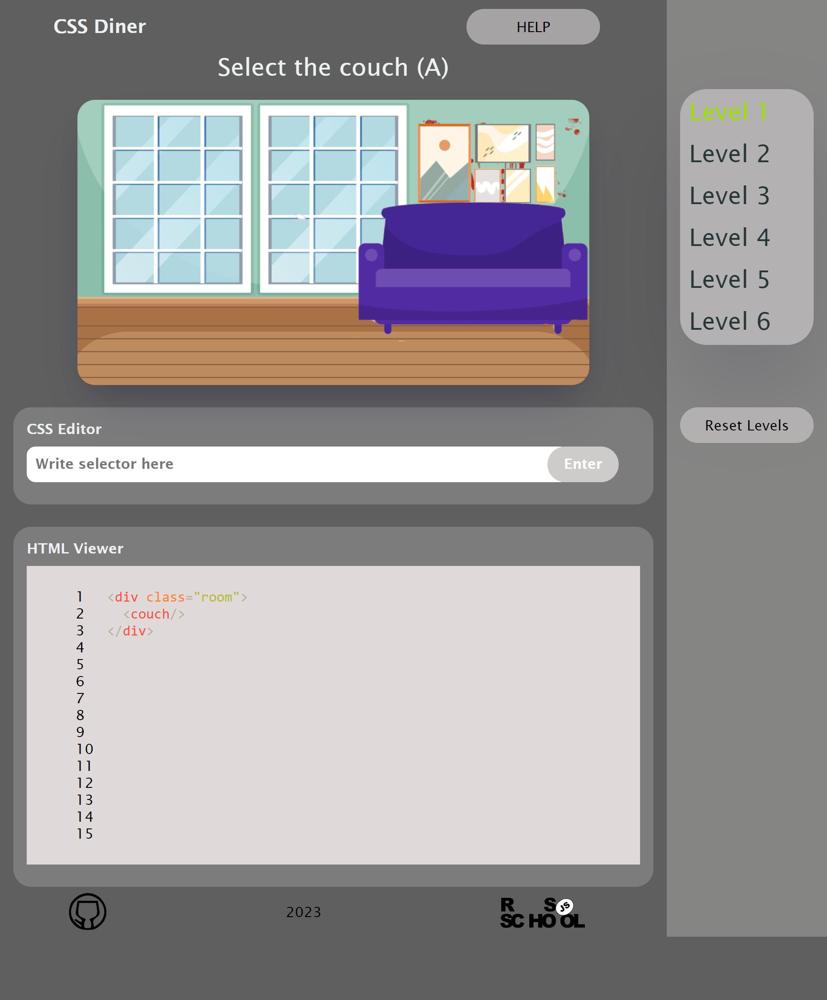

##  An adaptive two-paged website with a slider and a pagination
#### **[Show project](https://sandrainporto.github.io/css-diner/)**

*********************************

###  Technologies : TypeScript + Webpack + ESLint.

#### Technical requirments:
 - приложение написано на TypeScript.

     - используется Everyday Types 
     - используются Generics
     - использование Object Types 
     - использование Classes 
     - использование Function 
     - нигде не используется тип Any 
   - код разбит на модули 
 
